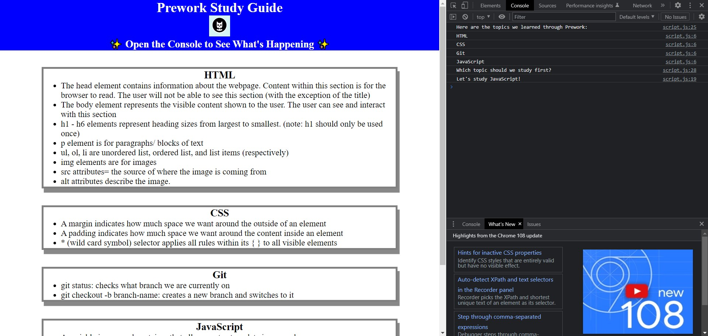

# Prework-Study-Guide

## Description

This study guide gives the user a brief overview of HTML, CSS, Git and Javascript. It is intended to help coding bootcamp students keep their notes in one place and organize their thoughts by sectioning each topic.

## Installation

Open the "index.html" file under the folder "prework-study-guide." Right click anywhere on the page and select "Open In Default Browser" or Alt+b to view the page.

## Usage

Simply scroll to navigate which section you want to learn. Bullet point notes are provided under each subheading for quick reading.

To view the html code, right click anywhere on the page and select "inspect" to open DevTools. You can also find the style.css sheet and scripts.js here. 

If you are unsure where to start, navigate to "Console" within Chrome's DevTools and you will get a randomized topic to start with.

## Credits

N/A

## License

Please refer to the LICENSE in the repo.
